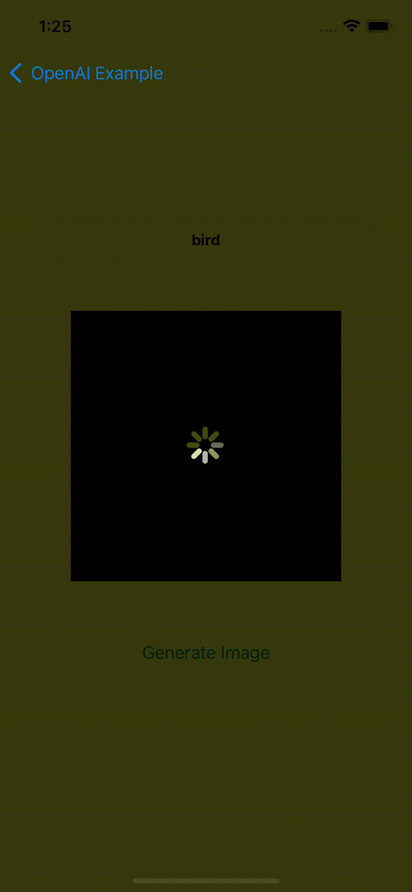

# OpenAI
[](https://swiftpackageindex.com/adamrushy/OpenAISwift)
[](https://swiftpackageindex.com/adamrushy/OpenAISwift)
[](https://swift.org/package-manager/) [](https://cocoapods.org/pods/OpenAI) [](https://cocoapods.org/pods/OpenAI)

## Example

To run the example project, clone the repo, and run `pod install` from the Example directory first.

## Installation

### CocoaPods

[CocoaPods](https://cocoapods.org) is a dependency manager for Cocoa projects. For usage and installation instructions, visit their website. To integrate OpenAI into your Xcode project using CocoaPods, specify it in your `Podfile`:

```ruby
pod 'OpenAI'
```

### Carthage

[Carthage](https://github.com/Carthage/Carthage) is a decentralized dependency manager that builds your dependencies and provides you with binary frameworks. To integrate OpenAI into your Xcode project using Carthage, specify it in your `Cartfile`:

```ogdl
github "JacksonJang/OpenAI"
```

### Swift Package Manager

The [Swift Package Manager](https://swift.org/package-manager/) is a tool for automating the distribution of Swift code and is integrated into the `swift` compiler. 

Once you have your Swift package set up, adding OpenAI as a dependency is as easy as adding it to the `dependencies` value of your `Package.swift`.

```swift
dependencies: [
    .package(url: "https://github.com/JacksonJang/OpenAI.git", .upToNextMajor(from: "1.0.0"))
]
```

## Usage
Only **3** steps needed to use `OpenAI`:

1️⃣ Import OpenAI in proper place.
```swift
import OpenAI
```

2️⃣ API token must be set.
If you don't have the token, you can create new secret key through below link.
https://beta.openai.com/account/api-keys

**Using code:**
```swift
func application(_ application: UIApplication, didFinishLaunchingWithOptions launchOptions: [UIApplication.LaunchOptionsKey: Any]?) -> Bool {

    OpenAI.setToken("YOU-NEED-SET-SECRET-KEY")
        
    return true
}
```

3️⃣ You can choose to use OpenAPI method (More features will be added..)

**Using code:**
 ```swift
OpenAI.makeImage(text: String,  count: Int, size: ImageSize,
                completion:@escaping (Result<ResponseImageModel, Errors>) -> Void)
 ```
 
 ## Example
 **Generate Image**
  ```swift
OpenAI.makeImage(text: "bird", count: 2, size: ._256x256, completion: { result in
            switch result {
            case .success(let model):
                let dic = model.data

                dic.forEach{
                    print("generated url : \($0.url)")
                }
            case .failure(let error):
                print("error : \(error.localizedDescription)")
            }
        })
}
 ```

## Preview

<table>
<tr>
<td width="100%">
<center>Generate Image</center>
</td>
</tr>
<tr>
<td width="100%">
</img>
</td>
</tr>
</table>

## References
- [Alamofire](https://github.com/Alamofire/Alamofire.git)
- [Moya](https://github.com/Moya/Moya.git)
- [OpenAISwift](https://github.com/adamrushy/OpenAISwift.git)

## License

OpenAI is available under the MIT license. See the LICENSE file for more info.
